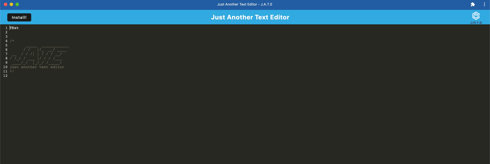
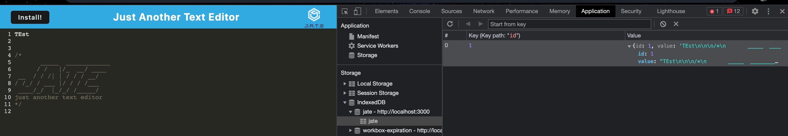

 

  # Title: Just Another Text Editor

  
  

  
  ## Description: This Project is a web based PWA. It allows the user to install the text editor locally on their machine. The Text editor also utsalizes indexDb to save entries in the text editor as a key value pair. When the user clicks the Install button, it installs the app locally on there Machine.

  ## Usage:  To use the app, the user runs NPM start, the webpack is compiled and the user opens a browwser to localhost port 3000. The User then has the option to install locally by clicking the "Install" buttone. The user is then prompted to install the application on their machine. The user then has the option to run the app int the browser or locally, even ofline if they choose.

  ## Questions: johndesgarennes@gmail.com

  ## Github username: jdesgarennes

  ## License type: MIT

